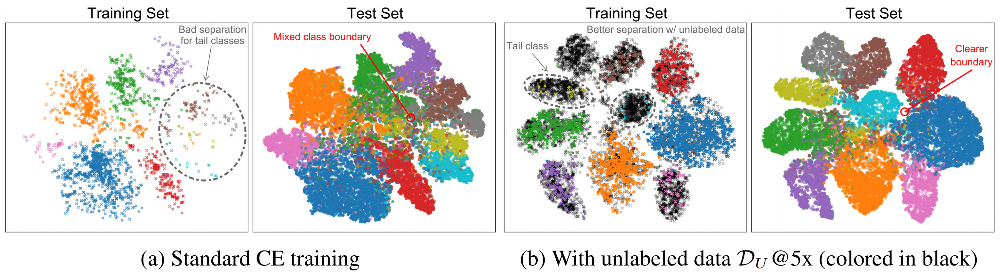
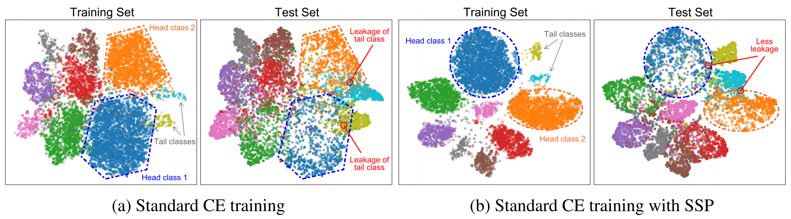

# Rethinking the Value of Labels for Improving Class-Imbalanced Learning

This repository contains the implementation code for paper: <br>
__Rethinking the Value of Labels for Improving Class-Imbalanced Learning__ <br>
[Yuzhe Yang](http://www.mit.edu/~yuzhe/), and [Zhi Xu](http://www.mit.edu/~zhixu/) <br>
_34th Conference on Neural Information Processing Systems (NeurIPS), 2020_ <br>
[[Website](https://www.mit.edu/~yuzhe/imbalanced-semi-self.html)] [[arXiv](https://arxiv.org/abs/2006.07529)] [[Paper](https://arxiv.org/pdf/2006.07529.pdf)] [Slides] [Video]

If you find this code or idea useful, please consider citing our work:
```bib
@inproceedings{yang2020rethinking,
  title={Rethinking the Value of Labels for Improving Class-Imbalanced Learning},
  author={Yang, Yuzhe and Xu, Zhi},
  booktitle={Conference on Neural Information Processing Systems (NeurIPS)},
  year={2020}
}
```


## Overview
In this work, we show theoretically and empirically that, both __semi-supervised learning__ (using unlabeled data) and __self-supervised pre-training__ (first pre-train the model with self-supervision) can substantially improve the performance on imbalanced (long-tailed) datasets, regardless of the imbalanceness on labeled/unlabeled data and the base training techniques.

__Semi-Supervised Imbalanced Learning__: 
Using unlabeled data helps to shape clearer class boundaries and results in better class separation, especially for the tail classes.


__Self-Supervised Imbalanced Learning__:
Self-supervised pre-training (SSP) helps mitigate the tail classes leakage during testing, which results in better learned boundaries and representations.



## Installation

#### Prerequisites
- Download [CIFAR](https://www.cs.toronto.edu/~kriz/cifar.html) & [SVHN](http://ufldl.stanford.edu/housenumbers/) dataset, and place them in your `data_path`. Original data will be converted by [`imbalance_cifar.py`](dataset/imbalance_cifar.py) and [`imbalance_svhn.py`](dataset/imbalance_svhn.py)
- Download [ImageNet](http://image-net.org/download) & [iNaturalist 2018](https://github.com/visipedia/inat_comp/tree/master/2018) dataset, and place them in your `data_path`. Long-tailed version will be created using train/val splits (.txt files) in corresponding subfolders under `imagenet_inat/data/`
- Change the `data_root` in [`imagenet_inat/main.py`](./imagenet_inat/main.py) accordingly for ImageNet-LT & iNaturalist 2018

#### Dependencies
- PyTorch (>= 1.2, tested on 1.4)
- yaml
- scikit-learn
- TensorboardX


## Code Overview

#### Main Files
- [`train_semi.py`](train_semi.py): train model with extra unlabeled data, on CIFAR-LT / SVHN-LT
- [`train.py`](train.py): train model with (or without) SSP, on CIFAR-LT / SVHN-LT
- [`imagenet_inat/main.py`](./imagenet_inat/main.py): train model with (or without) SSP, on ImageNet-LT / iNaturalist 2018
- [`pretrain_rot.py`](pretrain_rot.py) & [`pretrain_moco.py`](pretrain_moco.py): self-supervised pre-training using [Rotation prediction](https://arxiv.org/pdf/1803.07728.pdf) or [MoCo](https://arxiv.org/abs/1911.05722)

#### Main Arguments
- `--dataset`: name of chosen long-tailed dataset
- `--imb_factor`: imbalance factor (inverse value of imbalance ratio `\rho` in the paper)
- `--imb_factor_unlabel`: imbalance factor for unlabeled data (inverse value of unlabel imbalance ratio `\rho_U`)
- `--pretrained_model`: path to self-supervised pre-trained models
- `--resume`: path to resume checkpoint (also for evaluation)


## Getting Started

### Semi-Supervised Imbalanced Learning

#### Unlabeled data sourcing

__CIFAR-10-LT__: CIFAR-10 unlabeled data is prepared following [this repo](https://github.com/yaircarmon/semisup-adv) using the [80M TinyImages](https://people.csail.mit.edu/torralba/publications/80millionImages.pdf). In short, a data sourcing model is trained to distinguish CIFAR-10 classes and an "non-CIFAR" class. For each class, images are then ranked based on the prediction confidence, and unlabeled (imbalanced) datasets are constructed accordingly. Use the following link to download the prepared unlabeled data, and place in your `data_path`:
- [Unlabeled dataset for CIFAR-10-LT from TinyImages](https://drive.google.com/file/d/1SODQBUvv2qycDivBb4nhHaCk3TMzaVM4/view?usp=sharing)

__SVHN-LT__: Since its own dataset contains an extra part with 531.1K additional (labeled) samples, they are directly used to simulate the unlabeled dataset.

Note that the class imbalance in unlabeled data is also considered, which is controlled by `--imb_factor_unlabel` (`\rho_U` in the paper). See [`imbalance_cifar.py`](dataset/imbalance_cifar.py) and [`imbalance_svhn.py`](dataset/imbalance_svhn.py) for details.

#### Semi-supervised learning with pseudo-labeling

To perform pseudo-labeling (self-training), first a base classifier is trained on original imbalanced dataset. With the trained base classifier, pseudo-labels can be generated using
```bash
python gen_pseudolabels.py --resume <ckpt-path> --data_dir <data_path> --output_dir <output_path> --output_filename <save_name>
```
We provide generated pseudo label files for CIFAR-10-LT & SVHN-LT with `\rho=50`, using base models trained with standard cross-entropy (CE) loss:
- [Generated pseudo labels for CIFAR-10-LT with `\rho=50`](https://drive.google.com/file/d/1Z4rwaqzjNoNQ27sofx1aDl8OLH-etoyP/view?usp=sharing)
- [Generated pseudo labels for SVHN-LT with `\rho=50`](https://drive.google.com/file/d/19VeMQ07unVq3hIjLN5LiXWZNTI4CiN5F/view?usp=sharing)

To train with unlabeled data, for example, on CIFAR-10-LT with `\rho=50` and `\rho_U=50`
```bash
python train_semi.py --dataset cifar10 --imb_factor 0.02 --imb_factor_unlabel 0.02
```

### Self-Supervised Imbalanced Learning

#### Self-supervised pre-training (SSP)
To perform Rotation SSP on CIFAR-10-LT with `\rho=100`
```bash
python pretrain_rot.py --dataset cifar10 --imb_factor 0.01
```

To perform MoCo SSP on ImageNet-LT
```bash
python pretrain_moco.py --dataset imagenet --data <data_path>
```

#### Network training with SSP models
Train on CIFAR-10-LT with `\rho=100`
```bash
python train.py --dataset cifar10 --imb_factor 0.01 --pretrained_model <path_to_ssp_model>
```

Train on ImageNet-LT / iNaturalist 2018
```bash
python -m imagenet_inat.main --cfg <path_to_ssp_config> --model_dir <path_to_ssp_model>
```


## Results and Models

All related data and checkpoints can be found via [this link](https://drive.google.com/drive/folders/1VbdqYZ0sqyApM6AdmCgsZd46TsPlQcpT?usp=sharing). Individual results and checkpoints are detailed as follows.

### Semi-Supervised Imbalanced Learning
#### CIFAR-10-LT
|   Model   | Top-1 Error |   Download    |
| --------- |:-----------:|:-------------:|
|CE + D_U@5x (`\rho=50` and `\rho_U=1`) |  16.79 | [ResNet-32](https://drive.google.com/file/d/1gIzvqSBf87LA_NGi0Ov488OVBAlCsAhr/view?usp=sharing) |
|CE + D_U@5x (`\rho=50` and `\rho_U=25`) |  16.88 | [ResNet-32](https://drive.google.com/file/d/18ACYaEvIOF_neoDCoVOorQGqcv8-qmyd/view?usp=sharing) |
|CE + D_U@5x (`\rho=50` and `\rho_U=50`) | 18.36 | [ResNet-32](https://drive.google.com/file/d/17eEb_USf2fgDq6vURzi2q3tda8DvTmzG/view?usp=sharing) |
|CE + D_U@5x (`\rho=50` and `\rho_U=100`) | 19.94  | [ResNet-32](https://drive.google.com/file/d/19eVBcGcA3eoD9ayxCw09Gn1wtWsESSwS/view?usp=sharing) |

#### SVHN-LT
|   Model   | Top-1 Error |   Download    |
| --------- |:-----------:|:-------------:|
|CE + D_U@5x (`\rho=50` and `\rho_U=1`) |  13.07 | [ResNet-32](https://drive.google.com/file/d/1i4baS9QT8atmiF1QZwIDua4mSoRUQb_E/view?usp=sharing) |
|CE + D_U@5x (`\rho=50` and `\rho_U=25`) |  13.36 | [ResNet-32](https://drive.google.com/file/d/1r_fkQtZYUYMxP9Angpjd_bDPY4iy31IQ/view?usp=sharing) |
|CE + D_U@5x (`\rho=50` and `\rho_U=50`) | 13.16 | [ResNet-32](https://drive.google.com/file/d/1sBkqxI2GiStMWUjKGAmmXLLgT0bJTb0T/view?usp=sharing) |
|CE + D_U@5x (`\rho=50` and `\rho_U=100`) | 14.54 | [ResNet-32](https://drive.google.com/file/d/1HGNk-tc3iy1cxbTlYGf8nboMZYIUN1nQ/view?usp=sharing) |

#### Test a pretrained checkpoint
```bash
python train_semi.py --dataset cifar10 --resume <ckpt-path> -e
```

### Self-Supervised Imbalanced Learning
#### CIFAR-10-LT
- Self-supervised pre-trained models (Rotation)

  |  Dataset Setting  |  `\rho=100` | `\rho=50` | `\rho=10` |
  | ---------- |:-----------:|:-----------:|:-----------:|
  | __Download__ | [ResNet-32](https://drive.google.com/file/d/1FVjuKvBrNBFrSRRLDmYpOsTZADsdDKfx/view?usp=sharing) |  [ResNet-32](https://drive.google.com/file/d/1HnJNTmWOS8Js6TjpFKmCcj87U3BvldqI/view?usp=sharing) | [ResNet-32](https://drive.google.com/file/d/1YXVlHDwVNPRHpbEUxEHCzVp_4lToX0N9/view?usp=sharing) |

- Final models (200 epochs)

  |   Model   |     `\rho`    | Top-1 Error |   Download    |
  | --------- |:-------------:|:-----------:|:-------------:|
  |CE(Uniform) + SSP| 10 |  12.28 | [ResNet-32](https://drive.google.com/file/d/1sk6j_QWwiCpbbulMOCnZAgDUxv28S85F/view?usp=sharing) |
  |CE(Uniform) + SSP| 50 |  21.80 | [ResNet-32](https://drive.google.com/file/d/1CnWBII1IqgtC-rXlk2NzMVwDJUPP6dxE/view?usp=sharing) |
  |CE(Uniform) + SSP| 100 |  26.50 | [ResNet-32](https://drive.google.com/file/d/1hhc5P3cLWHYkCmKrk1Zvl5XwXsegpdQS/view?usp=sharing) |
  |CE(Balanced) + SSP| 10 |  11.57 | [ResNet-32](https://drive.google.com/file/d/1wSG3lk2u1n5WYb4iY0D8EMG4ERhWxJN1/view?usp=sharing) |
  |CE(Balanced) + SSP| 50 |  19.60 | [ResNet-32](https://drive.google.com/file/d/1EoyWw9sXucCyUdOQ1m6QLc6jDr2VceCG/view?usp=sharing) |
  |CE(Balanced) + SSP| 100 |  23.47 | [ResNet-32](https://drive.google.com/file/d/1Hkle1XEjzNrRRYbRRN-3aZkVlauwU161/view?usp=sharing) |

#### CIFAR-100-LT
- Self-supervised pre-trained models (Rotation)

  |  Dataset Setting  |  `\rho=100` | `\rho=50` | `\rho=10` |
  | ---------- |:-----------:|:-----------:|:-----------:|
  | __Download__ | [ResNet-32](https://drive.google.com/file/d/1gTlVOG9Wf3m6mcjvsjaqYFt6NsyIaWGn/view?usp=sharing) |  [ResNet-32](https://drive.google.com/file/d/1Rvhdscw2ZfDRAsCQ3a_A-o_Ay3UEeu3c/view?usp=sharing) | [ResNet-32](https://drive.google.com/file/d/1iOCguSnCXJrFDLe1mmmnK39dnLPcDv4Y/view?usp=sharing) |
  
- Final models (200 epochs)

  |   Model   |     `\rho`    | Top-1 Error |   Download    |
  | --------- |:-------------:|:-----------:|:-------------:|
  |CE(Uniform) + SSP| 10 |  42.93 | [ResNet-32](https://drive.google.com/file/d/1aXwZ5Zm2LGUYJuzL9AbCD4a0G3clx-0O/view?usp=sharing) |
  |CE(Uniform) + SSP| 50 |  54.96 | [ResNet-32](https://drive.google.com/file/d/11I60p5tNEf1KOXI2CnqMP7oph540ufjC/view?usp=sharing) |
  |CE(Uniform) + SSP| 100 |  59.60 | [ResNet-32](https://drive.google.com/file/d/1I5Ro0Jdw30fT28XPzV4jZYbg0htlukfw/view?usp=sharing) |
  |CE(Balanced) + SSP| 10 |  41.94 | [ResNet-32](https://drive.google.com/file/d/1URi-XE4Ua9Eahl1mzK4sTvolOdabaJ4q/view?usp=sharing) |
  |CE(Balanced) + SSP| 50 |  52.91 | [ResNet-32](https://drive.google.com/file/d/1HXUYWDnywJ9CSSvwWIKMOlX2u5LNOl_w/view?usp=sharing) |
  |CE(Balanced) + SSP| 100 |  56.94 | [ResNet-32](https://drive.google.com/file/d/1Fsg8wWpEScNXzdBavfs8Kxl3efAz-MAP/view?usp=sharing) |

#### ImageNet-LT
- Self-supervised pre-trained models (MoCo) <br>
  [[ResNet-50](https://drive.google.com/file/d/1XritMl3dYa9iW-TomaKU1XLQJVqgopMz/view?usp=sharing)]

- Final models (90 epochs)

  |   Model   | Top-1 Error |   Download    |
  | --------- |:-----------:|:-------------:|
  |CE(Uniform) + SSP |  54.4 | [ResNet-50](https://drive.google.com/file/d/13Bxu4yzSoZAzh_q--HtrFTRA4K2WiU8W/view?usp=sharing) |
  |CE(Balanced) + SSP |  52.4 | [ResNet-50](https://drive.google.com/file/d/1a4QTeCWrQq3Sow2raYl_ASzSDTBq48xs/view?usp=sharing) |
  |cRT + SSP |  48.7 | [ResNet-50](https://drive.google.com/file/d/1LAe-2gGZ4dVKy76wIpT-FbBR-kuyCfJ4/view?usp=sharing) |

#### iNaturalist 2018
- Self-supervised pre-trained models (MoCo) <br>
  [[ResNet-50](https://drive.google.com/file/d/1uY1KyofLf5Wp-fKU9lA47G7MXZkmI8rQ/view?usp=sharing)]

- Final models (90 epochs)

  |   Model   | Top-1 Error |   Download    |
  | --------- |:-----------:|:-------------:|
  |CE(Uniform) + SSP |  35.6 | [ResNet-50](https://drive.google.com/file/d/1Ry0afHMGkx6sh7Z8sM9zUtc2VclTCF9h/view?usp=sharing) |
  |CE(Balanced) + SSP |  34.1 | ResNet-50 |
  |cRT + SSP |  31.9 | [ResNet-50](https://drive.google.com/file/d/1bAUFns0CJJJi2-6MpvXCOmRlcciv1ef3/view?usp=sharing) |

#### Test a pretrained checkpoint
```bash
# test on CIFAR-10 / CIFAR-100
python train.py --dataset cifar10 --resume <ckpt-path> -e

# test on ImageNet-LT / iNaturalist 2018
python -m imagenet_inat.main --cfg <path_to_ssp_config> --model_dir <path_to_model> --test
```


## Acknowledgements
This code is partly based on the open-source implementations from the following sources:
[OpenLongTailRecognition](https://github.com/zhmiao/OpenLongTailRecognition-OLTR), [classifier-balancing](https://github.com/facebookresearch/classifier-balancing), [LDAM-DRW](https://github.com/kaidic/LDAM-DRW), [MoCo](https://github.com/facebookresearch/moco), and [semisup-adv](https://github.com/yaircarmon/semisup-adv).


## Contact
If you have any questions, feel free to contact us through email (yuzhe@mit.edu & zhixu@mit.edu) or Github issues. Enjoy!
